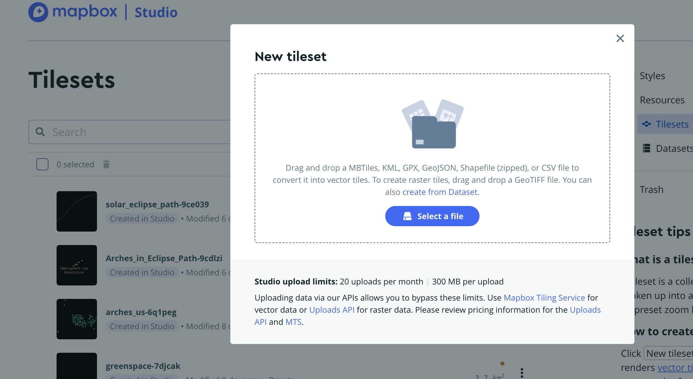

# Final Project: Arches in the April 2024 Solar Eclipse Path of Totality

This map was born from the idea that someone might want to view the April 8, 2024 solar eclipse from a natural arch in the United States. The end result was a Mapbox style that you can find on the website I created [here]((maps/index.html)). 

In the data folder, you will find all the data sources that I used to create my app. Among these you will find the arches.geojson file which I drew from the National File on [Geographic Names Information System](https://www.usgs.gov/us-board-on-geographic-names/download-gnis-data) and the 2024eclipse_shapefiles.zip that I drew from NASA's [Scientific Visualization Studio] (https://svs.gsfc.nasa.gov/5073).

The zip file from NASA contained a variety fo files, but only one was needed to complete my mission. Upath_lo.shp contains the path of totality for the eclipse, so we loaded that shapefile and the arces geojson into QGIS as vector layers. 

>

>

The resulting map: 

> 

Because I only wanted to see the arches in side the path of totality, I knew I needed to use a geoprocessing tool to get the map I wanted. The Intersection tool gave me exactly what I needed. 

> 

It should look like this: 

>

The next step was to save the eclipse path file as a geojson so that we can import it into Mapbox. I'm choosing Mapbox to display this data because it's templates provide data that might otherwise take more time, and it's also more aesthetically pleasing. 

I chose the Outdoors template for my style, I uploaded both layers as tilesets, then got to designing! 

> 

I also added an outline of Kentucky so that I could see if there were any options for viewing in my state. Unfortunately, there are none.

It was my opinion that Mapbox creates more aesthetic maps, which was a goal of mine in this class. So I took my layers and imported them into a Mapbox style as tilesets. I used the template "Outdoors" to get a map that automatically showed features like contour, roads, cities, etc. 

Enjoy my final project. 
